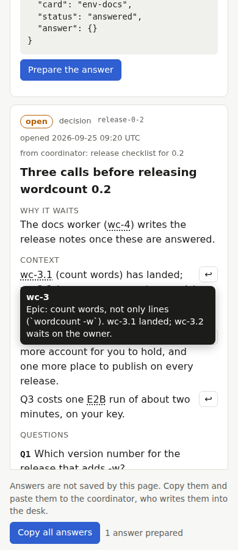
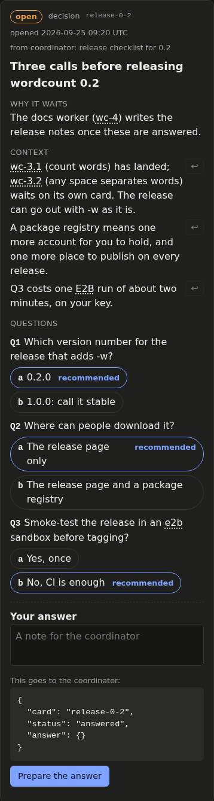
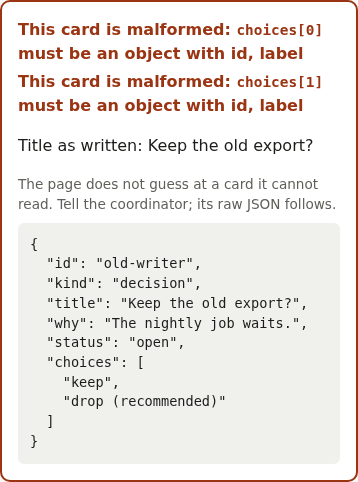
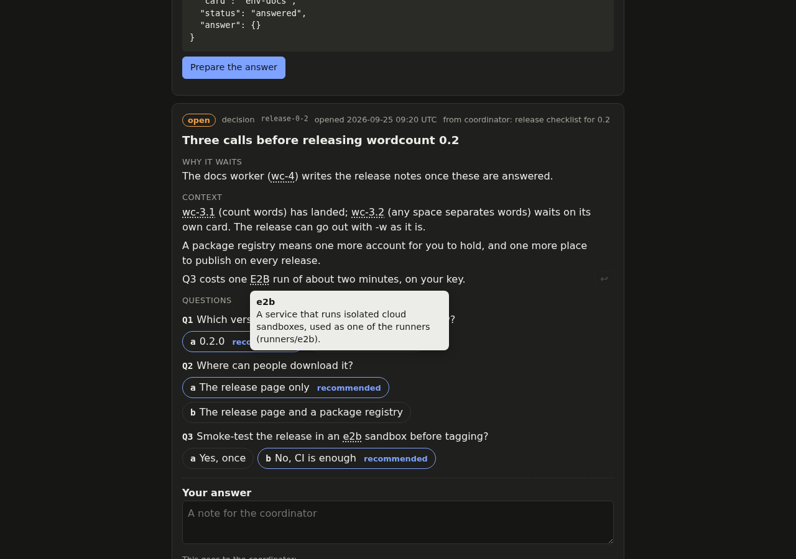

# desk/

Two ways to keep the decision desk (`docs/desk.md`): a static page, or GitHub
Issues ([`github-issues.md`](github-issues.md)).

## The static page

`index.html` renders `desk.json`: one HTML file, inline CSS and JavaScript, no
framework, no build, no server. It shows each card's title, why it waits,
context, steps, texts to paste (whole, each with a copy button), choices
(the recommended one marked), links, answer, status and resolution, grouped
as *waiting on you*, *answered* and *done*. It works at phone width and has
light and dark themes (the system's, or chosen with the Theme button).

- **Where it reads from.** Served over HTTP (any static host, or
  `python3 -m http.server` in this directory), it loads `desk.json`, else
  `desk.example.json`, or the file named by `?src=`. Opened straight from disk
  (`file://`), the browser does not let a page read files next to it, so the
  page asks for the file: **Open a desk file**, or drop it on the page.
- **Every card is checked before it is shown.** A card that does not fit the
  schema is shown at the top as malformed, naming the field and holding its
  raw JSON, never dropped or half-rendered.
- **Several questions in one card** render as rows of pills, the key in
  monospace and the recommended option marked. The answer's note is composed
  as one `<id> <key>` line per answered question, then the free text; a live
  preview shows what goes to the coordinator.
- **Quoting.** On an open card, each context paragraph has a "↩" button (on
  hover, or always on touch screens) that adds `<ID>: ` to the answer when the
  paragraph starts with an id (`Q3`, `ABC-12`, `wc-3.1`), else a quote of up to
  80 characters and ` — `.
- **A glossary.** Terms, epics and abbreviations from the desk's `glossary`,
  and ids matching its `idPattern`, are underlined and explained in a tooltip
  on hover, focus or tap.
- **Nothing becomes HTML.** The page builds every node with `createElement` and
  puts every text in as text, glossary summaries included.
- **The format** is [`desk.schema.json`](desk.schema.json);
  [`desk.example.json`](desk.example.json) has four cards (an environment to
  create, three questions in one card, a decision with choices, a question
  answered with a note) and a glossary with an alias and an id pattern.

| Phone, light | Phone, dark, and a malformed card | Desktop, dark, a term explained |
|---|---|---|
|  |   |  |

### Answers: a snippet to paste, not a file to download

A static page cannot write `desk.json`. The page could offer the owner a new
`desk.json` to download, or a snippet to copy. It gives the snippet:

```json
{
  "card": "wc-3-unicode",
  "status": "answered",
  "answer": { "choice": "unicode-spaces", "note": "…", "at": "2026-09-25T09:32:00.000Z" }
}
```

The owner pastes it to the coordinator (one card, or **Copy all answers**),
and the coordinator writes it into `desk.json`. Why not a download:

- **One writer.** The coordinator is the only writer of the desk, as of the
  tracker. A downloaded `desk.json` is a second copy of the whole queue, made
  from whatever version the page loaded; putting it back would overwrite
  cards the coordinator added or closed since.
- **The answer is data.** A snippet names one card and carries only
  `{choice, note, at}`. The coordinator applies it within the question asked
  and nothing else; a whole file would make it diff the queue to find out
  what the owner changed.
- **It fits the channel.** The owner already talks to the coordinator in chat;
  pasting there needs no file handling on a phone.

## Checks

`tests/desk.test.mjs` (`node --test`, no dependencies) runs the page's own
script against a minimal DOM whose `innerHTML` throws, and checks: the example
renders without problems and shows every field of the schema; a malformed card
is shown with its field and raw JSON; the page's card check agrees with
`jsonschema` on every card in `tests/fixtures/desk/cards/`; the note composed
from questions; the quote line with and without a leading id; glossary
wrapping (longest match, no match inside a word, aliases, the id pattern) and
that a `<script>` in a summary stays text. `tests/examples.bats` checks
the example against the schema.

The page was also driven in Chromium (2026-09-25, not part of `make check`):
the example renders at 375 px wide without horizontal scrolling, in light and
dark; preparing an answer shows the snippet; opened from `file://`, it asks
for the file and renders it once chosen. The only console message was the
expected 404 for `desk.json` before falling back to the example.
